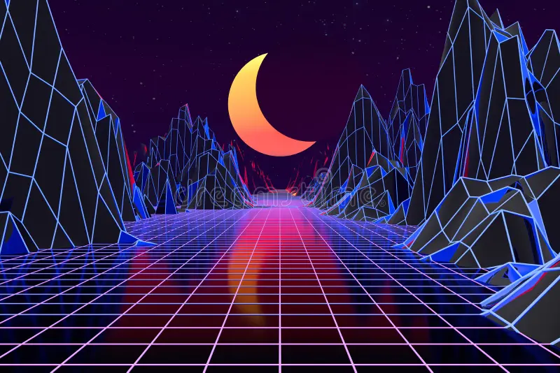
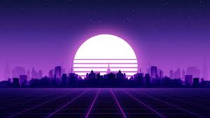

# Visualization: Cyber-Valley

Uses Mirroed spectrum to generate "hills" on either side of a "road" in the middle of the screen.

Updates a texture with current "hills" and pushes them up and zooms them out to simulate a fading into the horizon effect.

The mountains are a series of historical "snapshots" of the spectrum.

The image below is a rough example of desired hills, but obviously it isnt mapped to music spectrum.

## Current Issues

Does not use texture for hills fading to horizon.

Road looks like crap. 

Moon is not circular but oval, and looks like crap.

## Update goals

### Road

please try and make a traditional road with bitumen type texture and dual white lines.

bonus points for adding "cats eyes" (what we call reflectors in australia) 

### Moon

make moon a circle (always) and stretch goal, make it look like the classic outrun / vapourwave moon with the horizontal stripes at the bottom.

example moon:

## Core Concept: 

### 1. The Mountain Logic (Immutable History)
- **Generation**: At a fixed interval (tied to the 'Speed' variable), update texture to move hills.
- **Movement**: the hills and road move towards the horizon at the same speed.
- **Perspective**: As the line moves toward the horizon, scale its width and height down to converge at the vanishing point.

### 2. Geometry & Mapping
- **V-Shape**: Map Bass to the far left/right edges and Treble toward the center. 

### 3. Synchronized Speed
- **Global Velocity**: The variable `m_cv2Speed` must control the retreat of hills and road.