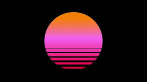

# Outrun

A vapourwave scene with toggable night and day sky.

3d mesh hill generated using mirrored specturm divided into 24 buckets and mirrored.

Bass buckets will be on the outer edge and high frequency in the middle.

# Controls

- \- decrease scroll speed
- = increase scroll speed
- v toggle night / day

# Scene

## Sky

### Day

Vapourwave sun centre of sky

See example image for sun reference:

should be setting with bottom 20% of sun below horizon.

Sky should be a purple haze with a glow around the sun and the horizon line.

### Night

Vapourwave moon centre of sky 20% below horizon.

Same style as sun but use blue and fade to purple instead of yellow to purple.

see  for reference.

Moon and horizon line should have a soft blue glow.

Sky should have slow starfield animation.

## Land

### Hills 

Uses Mirroed spectrum to generate "hills" on either side of a "road" in the middle of the screen.

The Hills will be 3d flurorescent blue made of a evenly spaced grid. 

- every 0.25 seconds a new horizontal line will be added to the front of the hills. this line will be made from the highest value seen in the spectrum. Increasing scroll speed reduces sampling time for horizontal line and decreasing scroll speed will increase sample time. Suggest min sample size of 0.1 seconds and max of 0.5 seconds.
- The grid peaks an lows of the latest line will connect to the previously added horizontal line.
- when the newest horizontal line is added to the 3rd shape the oldest will be removed.
- the hills peaks will move back so that each new horizonatal line appears smoothly, this will help generate a scrolling effect.
- the oldest horizontal line for the hills will be at the horizon line.
- the newsest horizontal line for the hills will be at the bottom of the screen.
- Hills will be a solid 3d mesh object so new peaks closer to the viewer will obscure view for older if higher. 

